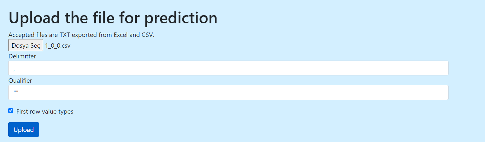

# Tutorial about the usage of Website
## Introduction
Here we provide a basic tutorial about using website. It shows how one can upload a csv file and use it to train a model.
### Opening the website
To run the website using flask, follow the small instructions written in the [README file.](../README.md). After running the application, website should be accessible in
http://127.0.0.1:5000/. If not, an error occured and should be handled
### Registering and Logging In
Register and login is easy as it sounds. After running the website, you have to login into your account to manage your data files. Register under the **Register** button. After registering, login to continue. 

### Uploading File
First screen that will be displayed after logging in will be **Workspace** page, where you can manage your data files. Click **Add Workspace** to create your workspace by uploading a file from your local computer. In this tutorial, we provide you a basic CSV file with no NaN (not-a-number) value present for simplicity. **Upload File** page will ask you to upload a csv or txt file. 
- For csv files, you do not have to provide a seperator and qualifier. If you upload txt file, provide seperator and qualifier, also select the checkbox if the first row that you have provided containts information about data types (this will be updated later)
- After uploading file, you can check your either from **Workspace** page or **Current Data** page. 
- Current Data shows the data that you are currently using. This file is temporarily but it can be downloaded- so it can be added to workspace.
- Workspace shows the data that you have uploaded/saved. Files in this section can be re-selected once again.

### Selecting parameters
The model we will train requires some set of attributes and variables to predict - namely X and y. These parameters can be selected in the **Atributes** button in the navigation bar. In this tutorial, we will select all parameters as X except parameters with *object* datatype.  Also we will try to predict *EyeResult* parameter. Following images show the selection pages.

### Model Training
After selecting parameters, you can create a new model in **Algorithms** page. Note that website will evaluate your objective from the selected y parameters so that you can choose models correctly. 
- Regression task
- Classification task
- Both
can be determined based on your selected parameters. Different models can be constructed and for simpilcity, we choose *Logistic Regression* model for training our model.

Hyperparameters of the model can be inputted by user - or else, default values will be used. Click **Submit** button to train model. If model is trained successfully, you will be redirect into **Result** page.

### Result
In **Result** page, you can see the loss/objective functions and result of the test data - so that you can determine whether the model is great or not. Depending on different tasks (Regression or Classification), different values will be displayed. Here is an example of **Result** page after training our data.

### Conclusion
In this simple tutorial, we showed how to upload file, train a model and look at the results. Note that many information of the website uses *session*, which will be cleared if users logs out or enters from a different browser. After logging out, all temporary files (such as currently used dataframe, selected parameters, last trained model) will be lost. 
